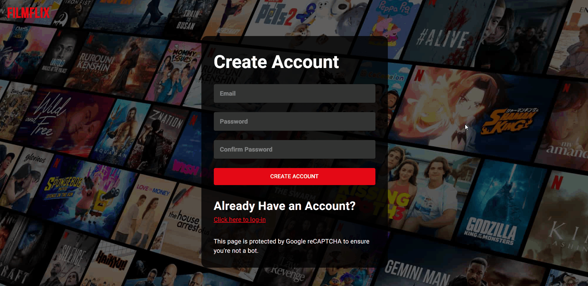
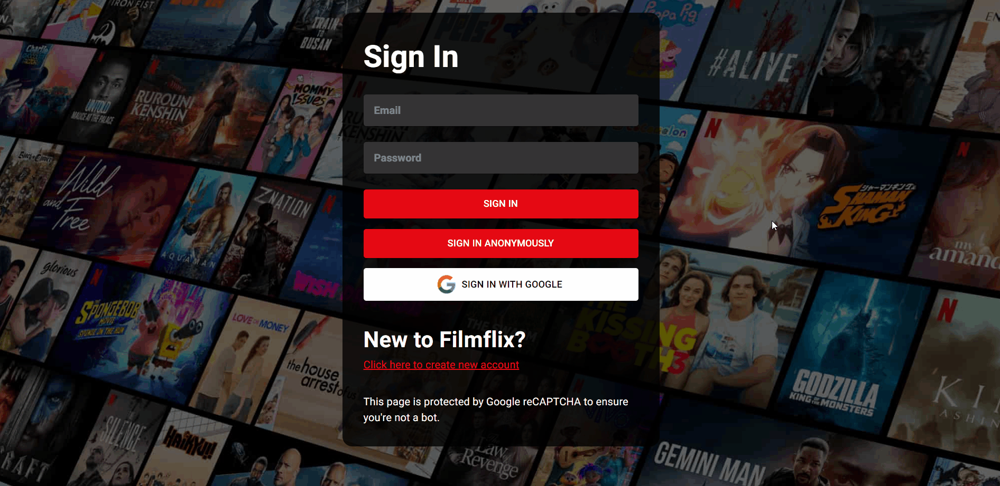
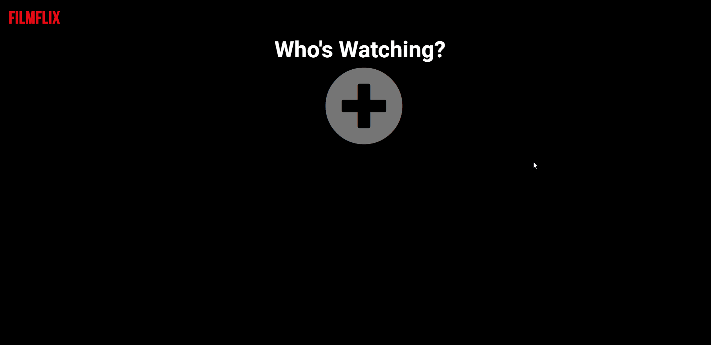
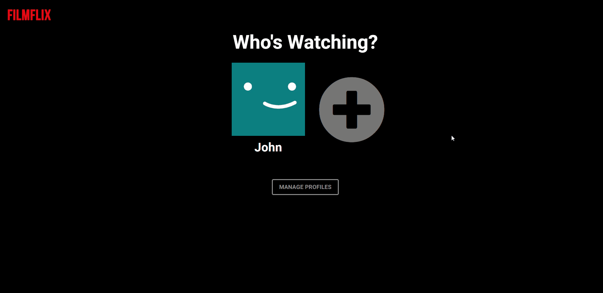
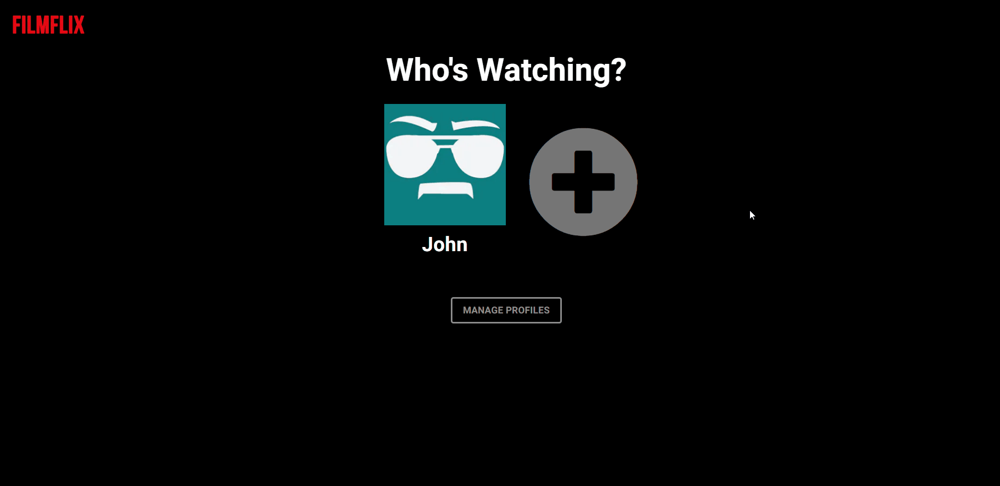
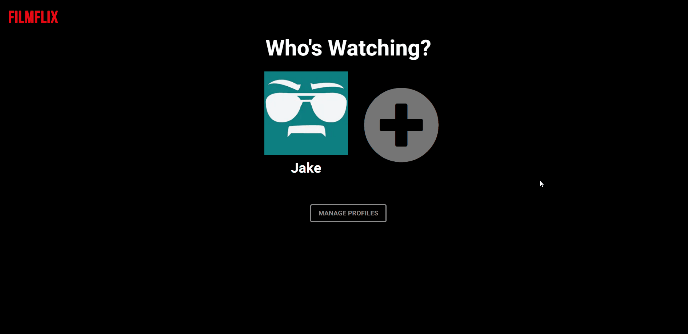
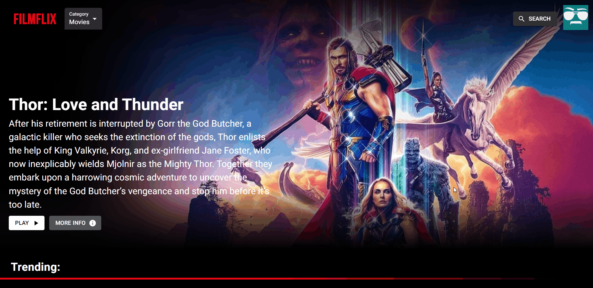

<div align="center">
    <h1>Filmflix</h1>
    <strong>
        <p>A movie database website inspired by <a href="https://www.netflix.com/">Netflix</a></p>
    </strong>
    <strong>
        <p><a href="https://filmflix-alpha-xyz.vercel.app/">You can view the live site here »<a></p>
    </strong>
    <br />
     <strong>
        <p>Note: You can also install this on your local machine since this is a PWA.</p>
    </strong>
</div>

<br />

<h3 align="center">Desktop View</h3>

https://user-images.githubusercontent.com/79429518/178148764-989302f2-9779-496f-acc7-81c1db6d41ea.mp4

<br />

<h3 align="center">Mobile View</h3>

https://user-images.githubusercontent.com/79429518/178147835-e4d76c60-fb50-4a92-9739-bdcf2c8d8b0b.mp4

<br />

## Table of Contents

1. [About the Project](#about-the-project)
    * [Built With...](#built-with)
    * [Features](#features)
2. [Building the Project](#building-the-project)
    * [Prerequisites](#prerequisites)
    * [Installation](#installation)
3. [Usage](#usage)
    * [Creating an Account](#creating-an-account)
    * [Logging In](#logging-in)
    * [Adding User Profile](#adding-user-profile)
    * [Editing User Profile](#editing-user-profile)
    * [Deleting User Profile](#deleting-user-profile)
    * [Searching for a Movie or a TV Show](#searching-for-a-movie-or-a-tv-show)
    * [Signing Out](#signing-out)

<br />

## About the Project

This project is created to expand my knowledge in React and Next JS, and how to structure a mid-level complexity web application. It is a movie database where you can view the information of a specific movie or tv show. It is mainly inspired by [Netflix's](https://www.netflix.com) design. I've also inserted a really close clone of Netflix's original splash animation (forked from a famous [Codepen from Claudio Bonfati](https://codepen.io/claudio_bonfati)), made entirely with CSS, paired with [Netflix's starting sound.](https://www.youtube.com/watch?v=GV3HUDMQ-F8) It took me months in making the project while also focusing on my college studies. As much as possible, I've tried to maintain this project, updating whenever a certain package has an update, as well as adding minor features, bug fixes and performance improvements. 


### Built With...
* [Next.js](https://nextjs.org/)
* [Typescript](https://www.typescriptlang.org/)
* [Firebase](https://firebase.google.com/)
* [React Hook Form](https://react-hook-form.com/)
* [Framer Motion](https://www.framer.com/motion/)
* [MUI](https://mui.com/)
* [SASS](https://sass-lang.com/)
* [TMDb API](https://www.themoviedb.org/)

### Features
✅ Display movies and tv shows categorized in different genres. <br />
✅  Search movies and tv shows. <br />
✅  View a movie's information such as it's overview, status, spoken language/s, genre, casts and similar movies. <br />
✅  View a tv show's information such as it's overview, date first aired, date last aired, status, spoken language/s, genre, seasons and episodes, casts and similar tv shows. <br />
✅  Customized splash animation from [Claudio Bonfati's Codepen](https://codepen.io/claudio_bonfati) paired with Netflix's starting sound. <br />
✅  Users can sign up with their google account, create their own Filmflix account, and sign in anonymously. <br />
✅  Responsive Layout (can be viewed from a galaxy fold to a 4k monitor screen). <br />
✅  Swipable movies and tv shows list like from Netflix.

<br />

## Building the Project

To run this project on your local machine, follow these steps:

### Prerequisites

* Install the latest [LTS Version of Node](https://nodejs.org/en/) and [Git](https://git-scm.com/)

* Install the latest version of npm

```bash
npm install npm@latest -g
```

### Installation

1. Clone the Project

```bash
git clone https://github.com/AdmiralFirefox/filmflix
```

2. Install npm packages and dependencies

```bash
npm install
```

3. Create .env.local file

4. Get your api key at the [TMDb website](https://www.themoviedb.org/) and add it to your .env.local file

```bash
NEXT_PUBLIC_API_KEY=XXXXXXXXXXXXXXXXXX
```

5. Sign in to [Firebase](https://firebase.google.com/), create a project and get your configurations, and add it to your .env.local file

```bash
NEXT_PUBLIC_FIREBASE_API_KEY=XXXXXXXXXXXXXXXXXX
NEXT_PUBLIC_AUTH_DOMAIN=XXXXXXXXXXXXXXXXXX
NEXT_PUBLIC_PROJECT_ID=XXXXXXXXXXXXXXXXXX
NEXT_PUBLIC_STORAGE_BUCKET=XXXXXXXXXXXXXXXXXX
NEXT_PUBLIC_MESSAGING_SENDER_ID=XXXXXXXXXXXXXXXXXX
NEXT_PUBLIC_APP_ID=XXXXXXXXXXXXXXXXXX
NEXT_PUBLIC_MEASUREMENT_ID=XXXXXXXXXXXXXXXXXX
```

6. Start the application

```bash
npm run dev
```

<br /> 

## Usage

### Creating an Account



1. Go to Sign In page.
    * From the home page, click the "Sign In" button or the "Get Started" button.
    * From the sign in page, click the "Click here to create new account."

2. Input the necessary fields.
    * Make sure the email is available and not in use.
    * Make sure the password is at least 8 characters long.
    * After inputting the necessary fields, click the "Create Account" button and you'll be signed in automatically.

### Logging In



1. Go to Sign In page.
    * From the home page, click the "Sign In" button or the "Get Started" button.

2. Sign In choices.
    * Here, the user has 3 choices when signing in:
        * Input the necessary fields and click the "Sign In" button.
        * Anonymously sign in by clicking "Sign In Anonymously" button.
        * Sign in with their google account by clicking the "Sign In with Google" button.

### Adding User Profile




1. Log in to your account.
2. Click the big plus icon and enter your name.
    * Make sure the name is available and does not already exist.
    * You can only have a maximum of 5 profiles.
3. Click add profile. 

### Editing User Profile

**Edit Profile Avatar**



<br />

**Edit Profile Name**



1. Log in to your account.
2. Click the "Manage Profiles" button below.
3. If you want to:
    * Edit Profile Avatar.
        * Click the edit icon in the avatar.
        * Select the avatar that you want and click the "Save Changes" button.
    * Edit Profile Name.
        * Click the edit icon beside the Profile Name.
        * Enter the name that you want and make sure the name is available and does not already exist.
        * Click the "Submit Edit" button when done.
4. When you're done editing, don't forget to click the "Save Changes" button below.

### Deleting User Profile



1. Log in to your account.
2. Click the "Manage Profiles" button below.
3. Click the "X" icon below the profile name.

### Searching for a Movie or a TV Show



1. Log in to your account and select a profile.
2. From the upper right of your screen beside your profile avatar, click the "Search" button.
3. If you want to search for a movie, make sure to search in the movie tab. And if you want to search for a tv show, make sure to search in the tv shows tab.

### Signing Out


1. Click your Profile Avatar at the upper right of your screen beside the "Search" button.
2. Click the "Sign Out" button.